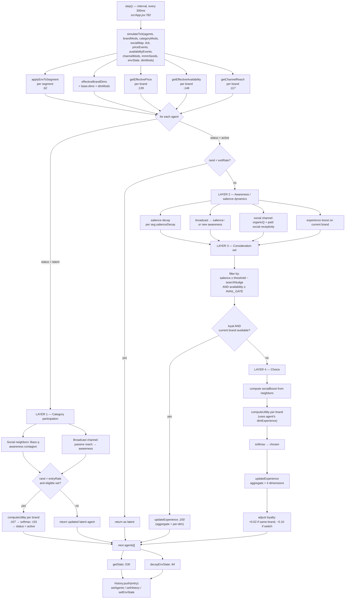

# Architecture

This document covers how the skincare ABM is wired together: the per-tick simulation pipeline and the scenario / Claude round-trip. Line references point into [`src/App.jsx`](../src/App.jsx) unless noted.

## At a glance

```
api/claude.js      Vercel serverless proxy — injects ANTHROPIC_API_KEY
src/main.jsx       React entry
src/App.jsx        Everything else: domain constants, simulation engine,
                   Claude prompts, UI (one file, ~1,800 lines)
```

Two architectural points worth keeping in mind while reading the diagrams below:

1. **API key boundary.** The browser never sees the Anthropic key. All Claude calls go to `/api/claude`, which forwards `req.body` to `https://api.anthropic.com/v1/messages` server-side (`api/claude.js`).
2. **Dual state storage.** Every piece of simulation state lives in both `useState` (drives renders) and a `useRef` mirror (`agentsRef`, `brandRef`, `envRef`, …). The 300 ms `setInterval` tick loop reads refs to avoid stale closures; React state exists only to re-render the UI.

## Per-tick simulation pipeline

`step()` (line 782) is fired every 300 ms by an interval. It calls `simulateTick` (line 272), which runs all four behavioural layers for every agent and returns the new agent array.



Things the diagram makes visible that prose can hide:

- `computeUtility` + `softmax` are called from **two** places — Layer 1 (latent agent entering the market) and Layer 4 (active agent's purchase choice).
- `updateExperience` runs in **both** the loyalty branch and the fresh-purchase branch, and within each it fires once for the aggregate satisfaction score and once per equity dimension (efficacy, prestige, value, naturalness).
- Environmental state (`envState`) flows in via `applyEnvToSegment` *before* utility is computed, and decays toward zero *after* the tick is applied.

## Scenario interpretation (Claude round-trip)

A user types a free-text scenario in the right pane. `handleScenario` (line 828) packages the current funnel snapshot, sends it to Claude with a long system prompt enumerating the eight tunable parameter classes, and merges the returned JSON into the simulation state.

```mermaid
flowchart LR
    U["user types scenario<br/>+ clicks RUN SCENARIO"] --> H["handleScenario<br/><i>src/App.jsx:828</i>"]

    H --> H1["getStats(agentsRef.current)<br/>→ funnel snapshot"]
    H1 --> IS["interpretScenario(query, stats, tick)<br/><i>:573</i>"]

    IS --> CC["callClaude({system, messages})<br/><i>:153</i>"]
    CC --> API["POST /api/claude<br/>(browser fetch)"]
    API --> SF["api/claude.js handler<br/>injects ANTHROPIC_API_KEY"]
    SF --> ANT["POST https://api.anthropic.com/v1/messages<br/>model: claude-sonnet-4-20250514"]
    ANT --> SF
    SF --> CC
    CC --> IS

    IS --> P["JSON.parse(response text)"]
    P --> R["{ brandModifiers, categoryModifiers,<br/>priceEvents, availabilityEvents,<br/>channelMods, mmmSeeds, dimMods,<br/>envStateEvents, narrative,<br/>scenarioTitle, primaryEffect }"]

    R --> M{layerMode?}
    M -->|yes| ML["mergeObj onto existing refs<br/>+ append event arrays"]
    M -->|no| MR["replace refs wholesale"]

    ML & MR --> S["setBrandMods / setPriceEvents / …<br/>brandRef.current = … (ref mirror)"]
    S --> SC["setActiveChart based on<br/>primaryEffect"]

    S -.->|next tick reads via refs| T["simulateTick<br/>(see diagram above)"]

    T --> HI["after a few ticks…"]
    HI --> GS["getStrategicInsight(history, scenario)<br/><i>:674</i>"]
    GS --> CC2["callClaude → /api/claude → Anthropic"]
    CC2 --> NS["setInsight(text)"]
```



The dashed edge is the bridge between the two pipelines: `handleScenario` writes ref mirrors, and the next `simulateTick` reads them. There is no message bus or event system — refs are the integration point.

## Glossary

| Term | Meaning |
| --- | --- |
| **tick** | One discrete simulation step. Fires every 300 ms while running. |
| **active / latent agent** | Active agents are in-market and own a brand; latent agents may enter via Layer 1. |
| **salience** | Per-agent, per-brand memory strength — decays each tick, refreshed by channels and purchases. |
| **consideration set** | Brands whose salience exceeds the segment's threshold *and* are available. |
| **dimExperience** | Per-agent, per-brand, per-dimension Bayes-updated belief about efficacy / prestige / value / naturalness. |
| **AVAIL_GATE** | 0.20 — below this availability, a brand is excluded from consideration entirely. |
| **brandMods / dimMods / channelMods / …** | The eight Claude-tunable parameter classes; applied on top of base brand definitions each tick. |
